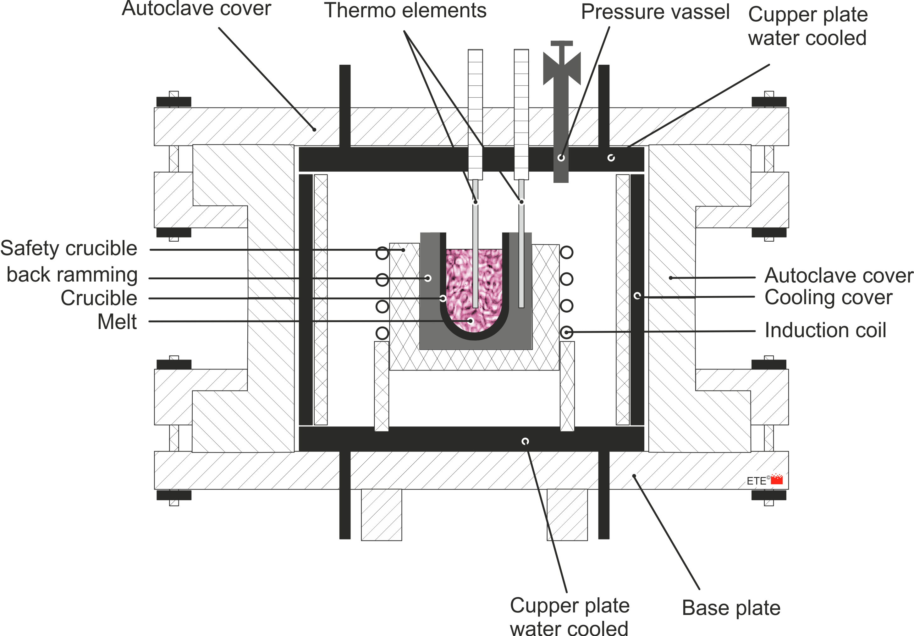

# HighNi

The limited solubility of nitrogen in molten steel can be overcome by alloying with nitrogen‑affinitive elements such as chromium, manganese, and molybdenum.

Another way to overcome the low solubility of nitrogen in molten steel is by introducing nitrogen at elevated pressure, which suppresses nitrogen outgassing and increases its solubility in the melt.

A pressure induction furnace (called HighNi) enables melting under a controlled high‑nitrogen atmosphere, typically in the range of several to several tens of bar. This provides several key advantages:

-   Increased nitrogen solubility in the melt in accordance with Sieverts’ law

-   Suppression of nitrogen desorption during the melting process

-   Possibility to combine high nitrogen pressure with Cr‑, Mn‑ or Mo-rich alloy concepts, which further stabilize nitrogen in solid solution

As a result, nitrogen contents well above the limits achievable under atmospheric pressure can be attained at laboratory scale.

This furnace represents an effective and versatile tool for systematically investigating the relationships between input parameters - such as alloying elements and nitrogen pressure - and the resulting nitrogen content across different steel grades.

The **p**ressure-**e**lectro**s**lag-**r**emelting (**PESR**) furnace at [Energietechnik Essen GmbH](https://www.gmh-gruppe.de/standorte/energietechnik-essen-gmbh/) enables an increase in nitrogen content in alloy grades even under operational conditions for large projects or customer requirements.

The intake of nitrogen in molten steel happens at the phase boundary between molten steel and nitrogen-gas. The higher the nitrogen-partial-pressure is, the higher is also the nitrogen content in the molten / solidified sample.

